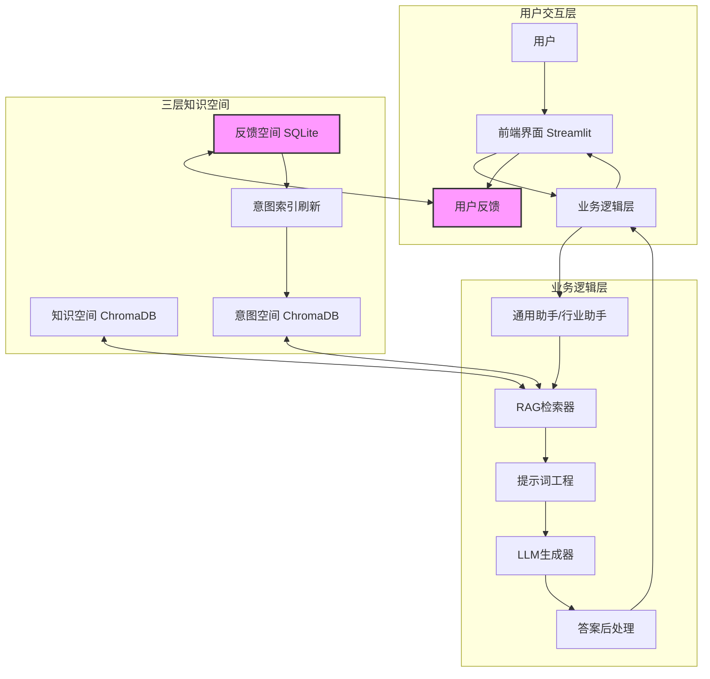

# AI RAG PRO 项目解决方案

## 1. 项目概述

### 1.1 项目名称
AI RAG PRO

### 1.2 项目目标
本项目旨在构建一个基于大型语言模型（LLM）和三层知识空间（知识空间、意图空间、反馈空间）的智能问答机器人。它将提供精准、可追溯源头、并能通过用户反馈持续进化的问答服务。

### 1.3 核心特点
- **三层知识结构**: 将知识源细分为**知识空间**（原始文档）、**意图空间**（高质量问答对）和**反馈空间**（用户反馈），实现对信息更精细化的管理和应用。
- **检索增强生成 (RAG)**: 结合外部知识库的精确检索与大型语言模型的强大生成能力，有效减少模型产生幻觉的风险，并显著提升回答的准确性和时效性。
- **闭环反馈系统**: 通过收集和分析用户反馈，形成一个持续学习和优化的闭环，使系统能够自我迭代，不断提升服务质量。
- **双模式助手**: 支持通用助手和行业助手两种模式，满足不同场景需求。

---

## 2. 系统架构

### 2.1 整体架构

系统整体架构遵循"输入-处理-输出-反馈"的模式，其核心数据流如下：



### 2.2 核心流程

**流程解析:**
1. **用户输入**: 用户通过Streamlit前端界面提出问题，选择助手模式（通用/行业）。
2. **模式判断**: 
   - **通用助手**: 直接调用LLM生成回答
   - **行业助手**: 进入RAG检索流程
3. **意图空间检索**（仅行业助手）: 首先从意图空间检索相似的历史问答对，如果相似度超过阈值（默认0.85），直接返回答案。
4. **知识空间检索**（仅行业助手）: 如果意图空间未匹配，从知识空间检索相关文档片段。
5. **构建提示词**: 将检索到的信息和用户问题整合成结构化的提示词（Prompt）。
6. **LLM生成**: 将构建好的提示词发送给大语言模型（DeepSeek/OpenAI/Qwen），生成回答。
7. **答案后处理**: 对LLM的输出进行处理，附上引用来源，格式化输出。
8. **用户反馈**: 用户对答案进行评价（0-5分评分、标签、改进建议），反馈数据被记录到**反馈空间**。
9. **自动优化**: 系统自动将高质量反馈（评分≥4且有改进建议）更新到意图空间索引。

---

## 3. 核心模块设计

### 3.1 知识空间 (Knowledge Space)

#### 定位
系统的主要信息来源，存放原始的、权威的知识文档。

#### 数据源
支持多种格式：`.txt`, `.md`, `.pdf` 等文档格式。

#### 实现方式
1. **文档加载**: 使用 `LlamaIndex SimpleDirectoryReader` 统一加载不同格式的文档。
2. **文本切分**: LlamaIndex 自动处理文档切分，将长文档切分为语义完整的小块（Chunks）。
3. **向量化**: 使用 `DashScope Text Embedding V2` 将文本块转换为高维向量。
4. **存储**: 将文本块原文、向量以及元数据存入 `ChromaDB` 向量数据库的 `knowledge_space` collection。

#### 技术细节
- **向量数据库**: ChromaDB（持久化存储）
- **Embedding模型**: DashScope Text Embedding V2
- **索引管理**: 使用 LlamaIndex VectorStoreIndex
- **自动刷新**: 支持手动刷新索引，重新加载文档

### 3.2 意图空间 (Intent Space)

#### 定位
高频问题和高质量答案的缓存与模板库。

#### 数据源
- 预定义的问答对文档（`rag_source/intent_space/`）
- 从反馈空间中提取的高质量问答对（评分≥1且有改进建议）

#### 核心作用
1. **快速响应**: 对于完全匹配或高度相似的问题（相似度≥0.85），可直接返回意图空间中的标准答案，降低延迟和成本。
2. **意图引导**: 将检索到的相似问答对作为示例加入到提示词中，引导LLM生成格式和内容更符合期望的答案。

#### 实现方式
- 与知识空间共享同一个ChromaDB数据库，但使用不同的`collection`（`intent_space`）进行隔离。
- 对用户问题进行向量化，检索最相似的Q&A对。
- 设定相似度阈值（默认0.85），若满足则直接采用其答案，否则继续查询知识空间。

#### 自动更新机制
- 当用户提交高质量反馈（评分≥4且有改进建议）时，系统自动刷新意图空间索引
- 将新的优质问答对加入意图空间

### 3.3 反馈空间 (Feedback Space)

#### 定位
系统自我进化的数据引擎。

#### 数据源
用户对回答的评价数据：
- **评分**: 0-5分评分系统
- **标签**: 问题类型标签（事实错误、不清晰、过时、不相关、其他）
- **改进建议**: 用户提供的答案改进文本
- **交互记录**: 自动记录所有问答交互（包括无反馈的），用于统计高频问题

#### 存储结构
使用SQLite关系型数据库，`interactions` 表结构：
```sql
CREATE TABLE interactions (
    id INTEGER PRIMARY KEY AUTOINCREMENT,
    question TEXT NOT NULL,
    answer TEXT NOT NULL,
    sources TEXT,
    rating INTEGER,           -- 0-5分，NULL表示无反馈
    correction TEXT,          -- 改进建议
    created_at DATETIME
)
```

#### 应用价值
1. **数据统计**:
   - 高频问题统计（相同问题出现次数）
   - 反馈质量分析（平均评分、反馈率）
   - 优质问答对提取（评分≥4的问答对）

2. **自动优化**:
   - 将高质量反馈自动更新到意图空间
   - 支持手动将优质问答对导入意图空间

3. **数据导出**: 支持导出反馈数据，用于进一步分析

---

## 4. 技术实现

### 4.1 技术选型（实际实现）

| 类别 | 技术/工具 | 说明 |
| :--- | :--- | :--- |
| **Web框架** | Streamlit | 快速构建交互式Web界面，单文件部署 |
| **RAG框架** | LlamaIndex | 提供完整的RAG管道组件，简化开发 |
| **向量数据库** | ChromaDB | 轻量级、易用的向量数据库，支持持久化 |
| **关系数据库** | SQLite | 轻量级反馈数据存储，无需独立服务 |
| **LLM** | DeepSeek / OpenAI / Qwen | 支持多种大语言模型，按优先级自动选择 |
| **Embedding模型** | DashScope Text Embedding V2 | 中文优化的文本向量化模型 |
| **Python版本** | Python 3.8+ | 推荐使用 Python 3.10+ |

### 4.2 核心组件

#### RAGManager (`src/retriever.py`)
- 负责知识空间和意图空间的索引创建和管理
- 提供查询引擎接口
- 支持索引刷新和更新

#### FeedbackStore (`src/feedback.py`)
- 管理反馈数据的存储和查询
- 提供高频问题统计
- 提取优质问答对

#### IndustryAssistant (`src/industry_assistant.py`)
- 实现行业助手的完整流程
- 意图空间和知识空间的检索逻辑
- 流式输出处理

#### GeneralAssistant (`src/general_assistant.py`)
- 实现通用助手的逻辑
- 直接调用LLM，不使用RAG

#### LLMService (`src/llm.py`)
- 统一的LLM服务接口
- 支持多种模型（DeepSeek、OpenAI、Qwen）
- 流式和非流式调用
- 思考过程支持

### 4.3 配置管理

系统使用 `config/config.json` 进行统一配置：

```json
{
    "api_keys": {
        "DEEPSEEK_API_KEY": "...",
        "OPENAI_API_KEY": "...",
        "DASHSCOPE_API_KEY": "..."
    },
    "models": {
        "deepseek": {...},
        "openai": {...},
        "qwen": {...}
    },
    "embedding": {
        "provider": "dashscope",
        "api_key_env": "DASHSCOPE_API_KEY"
    },
    "rag": {
        "knowledge_space_dir": "./rag_source/knowledge_space",
        "intent_space_dir": "./rag_source/intent_space",
        "chroma_db_path": "./data/chroma_db",
        "use_chroma": true,
        "default_k_knowledge": 3,
        "default_k_intent": 1,
        "default_intent_threshold": 0.85
    },
    "default_llm": "deepseek",
    "priority_order": ["deepseek", "openai", "qwen"]
}
```

---

## 5. 功能特性

### 5.1 已实现功能

#### ✅ 核心功能
- [x] 三层知识空间架构（知识空间、意图空间、反馈空间）
- [x] 双模式助手（通用助手、行业助手）
- [x] RAG检索增强生成
- [x] 意图空间快速匹配
- [x] 用户反馈系统（评分、标签、改进建议）
- [x] 自动优化机制（反馈自动更新到意图空间）
- [x] 多模型支持（DeepSeek、OpenAI、Qwen）
- [x] 流式输出
- [x] 思考过程展示（可选）

#### ✅ 管理功能
- [x] 知识空间管理页面
- [x] 意图空间管理页面
- [x] 反馈空间管理页面
- [x] 高频问题统计
- [x] 优质问答对提取
- [x] 数据导出功能

#### ✅ 技术特性
- [x] ChromaDB向量存储
- [x] SQLite反馈存储
- [x] 配置化管理
- [x] 错误处理和日志
- [x] 缓存机制（Streamlit cache）

### 5.2 待优化功能

#### 🔄 可优化项
- [ ] 查询预处理（查询重写、扩展）
- [ ] Reranker模型集成（重排序）
- [ ] 多模态支持（图片、表格）
- [ ] Agent化（工具调用）
- [ ] 用户个性化
- [ ] 后端API分离（FastAPI）
- [ ] Docker容器化部署

---

## 6. 使用指南

### 6.1 快速开始

1. **安装依赖**: `pip install -r requirements.txt`
2. **配置API密钥**: 编辑 `config/config.json`
3. **准备知识文档**: 将文档放入 `rag_source/knowledge_space/`
4. **运行应用**: `streamlit run 首页.py`

### 6.2 使用流程

1. **选择助手模式**: 通用助手或行业助手
2. **调整参数**（行业助手）: 设置检索数量、相似度阈值
3. **提问**: 输入问题，系统自动检索和生成回答
4. **查看来源**: 查看回答的来源文档和相似度分数
5. **提交反馈**: 对回答进行评分和反馈
6. **管理空间**: 使用管理页面查看和管理各空间数据

### 6.3 最佳实践

- **知识空间**: 放置结构化的、权威的知识文档
- **意图空间**: 放置常见问题的标准答案
- **反馈优化**: 定期查看反馈数据，将优质问答对导入意图空间
- **参数调优**: 根据实际效果调整检索参数和相似度阈值

---

## 7. 项目状态

### 7.1 当前版本
**v1.0** - 基础功能完整版

### 7.2 已完成阶段
- ✅ **第一阶段: MVP** - 基础RAG问答流程
- ✅ **第二阶段: 完善意图与反馈** - 三层知识空间和反馈系统

### 7.3 开发中
- 🔄 **第三阶段: 高级优化** - 查询预处理、Reranker等

### 7.4 计划中
- 📋 **第四阶段: 产品化与部署** - API分离、容器化部署

---

## 8. 未来展望

- **Agent化**: 将问答机器人升级为能够调用外部工具（如搜索引擎、计算器、API）的智能代理（Agent），解决更复杂的问题。
- **多模态支持**: 扩展系统能力，支持对图片、表格、音视频等内容的理解和问答。
- **主动学习**: 设计更智能的策略，自动从未经标注的反馈中挖掘有价值的数据，以降低人工标注成本。
- **个性化**: 结合用户画像或历史对话，提供更加个性化和上下文感知的回答。
- **性能优化**: 引入缓存机制、异步处理等优化手段，提升系统响应速度。
- **可扩展性**: 支持分布式部署、多租户架构等企业级特性。

---

## 9. 参考文档

- [README.md](../README.md) - 项目使用说明
- [Chroma迁移完成.md](Chroma迁移完成.md) - 向量存储迁移文档
- [代码清理总结.md](代码清理总结.md) - 代码优化记录
- [优化建议.md](优化建议.md) - 项目优化建议

---

**最后更新**: 2024年

**维护者**: AI-RAG-Pro Team
